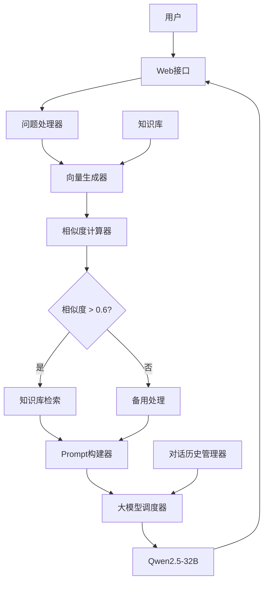

# 执行流程说明

## 系统整体架构

本系统采用模块化设计，主要包括以下几个核心模块：
1. **用户接口层**：接收用户问题并返回答案
2. **问题处理层**：解析和处理用户问题
3. **知识检索层**：检索相关知识点
4. **大模型调用层**：生成最终回答
5. **知识库层**：存储和管理知识点

## 详细执行流程

### 步骤1：用户输入
```
用户 -> Web接口 -> 问题处理器
```
- 接收用户通过API接口提交的自然语言问题
- 将问题传递给问题处理器进行预处理

### 步骤2：向量化处理
```
问题处理器 -> 向量生成器
知识库 -> 向量生成器
```
- 使用text-embedding-3-small模型对用户问题进行向量化处理
- 对知识库中的所有知识点进行向量化处理

### 步骤3：相似度计算与检索
```
向量生成器 -> 相似度计算器 -> 知识检索器
```
- 计算用户问题向量与所有知识点向量的余弦相似度
- 按相似度降序排序
- 取Top3知识点作为相关知识点
- 若Top3相似度均小于0.6，则跳过知识库检索

### 步骤4：Prompt构建
```
知识检索器 -> Prompt构建器
```
- 如果使用知识库信息：
  ```
  你是一名初中数学老师，专注二次根式教学。
  参考知识库：
  {课程名称1}: {知识点1}
  {课程名称2}: {知识点2}
  {课程名称3}: {知识点3}
  ```
- 如果不使用知识库信息（相似度低于阈值）：
  ```
  你是一名数学家教，请用简洁的语言回答八年级二次根式问题：{user_question}
  ```

### 步骤5：大模型调度
```
Prompt构建器 -> 大模型调度器 -> Qwen2.5-32B接口
```
- 根据构建的Prompt调用Qwen2.5-32B大模型
- 传递对话上下文（最多保留三轮对话历史）

### 步骤6：返回结果
```
Qwen2.5-32B接口 -> Web接口 -> 用户
```
- 将大模型生成的结果通过API接口返回给用户

### 步骤7：持续对话
```
对话历史管理器
```
- 保存当前对话历史
- 最多保留三轮对话历史用于上下文理解

## 模块调用关系图



## 性能优化策略

1. **向量预计算**：系统启动时预计算知识库向量并加载到内存
2. **相似度阈值机制**：设置0.6的相似度阈值，避免低质量匹配
3. **并发处理**：所有请求并发执行，提高系统响应速度
4. **缓存机制**：向量计算结果缓存到文件，减少重复计算

## 数据流说明

1. **用户问题数据流**：
   ```
   用户输入 -> 自然语言处理 -> 向量表示 -> 相似度计算 -> 知识点匹配
   ```

2. **Prompt构建数据流**：
   ```
   匹配结果 -> Prompt模板 -> 系统提示词
   ```

3. **大模型调用数据流**：
   ```
   系统提示词 + 用户问题 -> 大模型API -> 回答结果
   ```